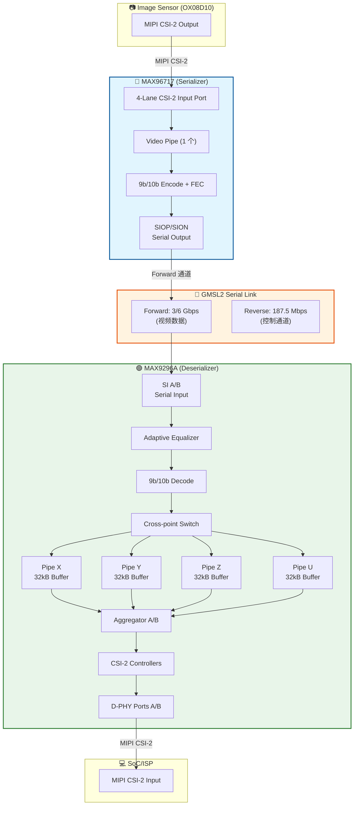
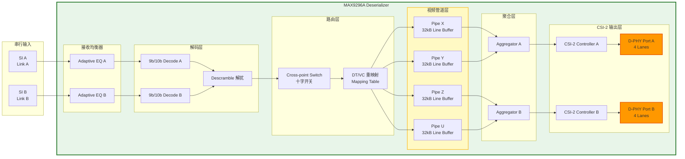
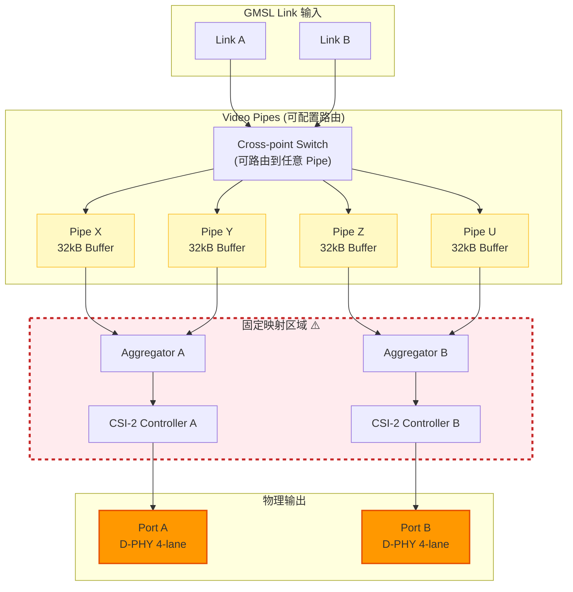
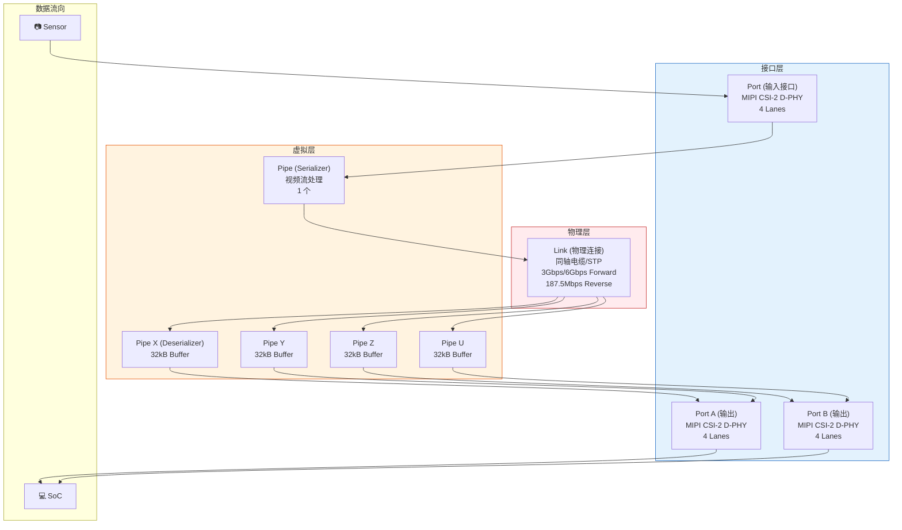

# GMSL2 MAX96717/MAX9296A SERDES Datapath 架构详解

> 文档版本：2.0  
> 更新日期：2026-03-04  
> 适用芯片：MAX96717 (Serializer) / MAX9296A (Deserializer)  
> 更新说明：添加 Pipe-to-Port 固定映射关系说明及调试指南

---

## 目录

- [核心概念：Link、Pipe、Port](#1-核心概念-linkpipeport-的区别)
- [系统架构总览](#2-系统架构总览)
- [Serializer 数据流](#3-serializer-max96717-数据流详解)
- [Deserializer 数据流](#4-deserializer-max9296a-数据流详解)
- [工作模式对比](#5-两种工作模式对比)
- [寄存器配置](#6-关键寄存器配置)
- [Pipe-to-Port 映射关系](#7-pipe-to-port-映射关系)
- [硬件调试指南](#8-硬件调试指南)
- [总结](#9-总结)

---

## 1. 核心概念：Link、Pipe、Port 的区别

这是理解 GMSL2 架构的关键，三者关系如下：

| 概念 | 定义 | 类比 | 数量 |
|------|------|------|------|
| **Link** | 物理串行连接（同轴电缆/双绞线） | 高速公路 | MAX96717: 1 个出<br>MAX9296A: 2 个入 (A/B) |
| **Pipe** | 虚拟视频数据流（带缓冲区） | 车道 | MAX96717: 1 个<br>MAX9296A: 4 个 (X/Y/Z/U) |
| **Port** | MIPI CSI-2 物理接口 | 出入口匝道 | MAX96717: 1 个入 (4-lane)<br>MAX9296A: 2 个出 (各 4-lane) |

**关系总结**：
```
Sensor → [Port] → [Pipe] → [Link] → [Pipe X/Y/Z/U] → [Port A/B] → SoC
         接口       处理       传输       缓冲        输出
```

---

## 2. 系统架构总览

### 2.1 整体架构图



### 2.2 芯片组角色

| 组件 | 角色 | 关键功能 |
|------|------|----------|
| **MAX96717** | Serializer | 将传感器的 MIPI CSI-2 转换为 GMSL2 串行流 |
| **MAX9296A** | Deserializer | 将 GMSL2 串行流转换回 MIPI CSI-2 输出 |

### 2.3 链路配置选项

```
Single Link:     Serializer → Deserializer (3Gbps/6Gbps forward)
Dual Link:       2x Serializer → 2x Deserializer (independent)
Dual Link (Combined): 2x Serializer → 1x Deserializer (10.4Gbps total)
```

---

## 3. Serializer (MAX96717) 数据流详解

```mermaid
flowchart LR
    subgraph Sensor_Output["传感器输出"]
        Sensor["Image Sensor<br/>OX08D10"]
    end
    
    subgraph MAX96717["MAX96717 Serializer"]
        direction TB
        
        subgraph CSI_Interface["CSI-2 接口层"]
            DPHY["D-PHY<br/>4 Lanes"]
            Deskew["Lane Deskew<br/>极性校正"]
        end
        
        subgraph CSI_Decoder["CSI-2 解码层"]
            CRC["CRC Check"]
            ECC["ECC Check"]
            Extract["包提取"]
        end
        
        subgraph Mode_Select["模式选择"]
            Tunnel{Tunnel Mode?}
            Pixel{Pixel Mode?}
        end
        
        subgraph Video_Processing["视频处理"]
            VP["Video Pipe<br/>视频管道"]
            Proc["像素处理<br/>(可选)"]
        end
        
        subgraph GMSL_Encode["GMSL2 编码层"]
            Encode["9b/10b 编码"]
            Scramble["Scramble 加扰"]
            FEC["FEC 前向纠错"]
        end
        
        subgraph Serial_Out["串行输出"]
            SIO["SIOP/SION<br/>3Gbps/6Gbps"]
        end
    end
    
    Sensor -->|MIPI CSI-2 数据包 | DPHY
    DPHY --> Deskew
    Deskew --> CRC
    CRC --> ECC
    ECC --> Extract
    Extract --> Tunnel
    Tunnel -->|是：透传 | VP
    Tunnel -->|否：解包 | Pixel
    Pixel --> Proc
    Proc --> VP
    VP --> Encode
    Encode --> Scramble
    Scramble --> FEC
    FEC --> SIO
    
    style MAX96717 fill:#e1f5fe,stroke:#01579b,stroke-width:3px
    style SIO fill:#ff9800,stroke:#e65100,stroke-width:2px
```



### 3.1 数据流步骤

1. **D-PHY 输入**：接收 4-lane MIPI CSI-2 信号
2. **Lane Deskew**：校正 lane  skew，处理极性反转
3. **CRC/ECC 校验**：验证数据包完整性
4. **模式选择**：
   - Tunnel Mode：直接透传 CSI-2 包
   - Pixel Mode：解包提取像素数据
5. **Video Pipe**：视频流处理（可选像素处理）
6. **9b/10b 编码**：DC 平衡编码
7. **Scramble**：加扰减少 EMI
8. **FEC**：添加前向纠错码
9. **串行输出**：通过 SIOP/SION 发送 3/6 Gbps 信号

---

## 4. Deserializer (MAX9296A) 数据流详解



### 4.1 数据流步骤

1. **Adaptive EQ**：自适应均衡器补偿电缆损耗
2. **9b/10b 解码**：恢复原始数据
3. **Descramble**：解扰
4. **Cross-point Switch**：路由到指定 Pipe
5. **DT/VC 重映射**：修改数据类型/虚拟通道（Pixel Mode）
6. **Line Buffer**：每个 Pipe 32kB 缓冲
7. **Aggregator**：FCFS 轮询读取，打包输出
8. **CSI-2 Controller**：生成 CSI-2 包
9. **D-PHY 输出**：通过 Port A/B 发送到 SoC

---

## 5. 两种工作模式对比

| 模式 | Tunnel Mode (隧道模式) | Pixel Mode (像素模式) |
|------|------------------------|------------------------|
| **数据处理** | CSI-2 包透传，不修改 | 解包 → 提取像素 → 重新打包 |
| **Header/Footer** | 保留原始 ECC/CRC | 重新生成 |
| **DT/VC 映射** | ❌ 不支持 | ✅ 支持重映射 |
| **Crosspoint 切换** | ❌ 不支持 | ✅ 支持任意路由 |
| **延迟** | 低 | 较高 |
| **使用场景** | 简单透传，低延迟要求 | 需要灵活路由/多路复用 |

---

## 6. 关键寄存器配置

### 6.1 MAX9296A (Deserializer) 配置

```c
// ========== 链路配置 ==========
0x0051, 0x02    // LINK_CFG: 双链路模式
0x0052, 0x01    // 启用 Link A
0x0333, 0x1b    // GMSL2 模式配置

// ========== 视频管道使能 ==========
0x0002, 0x63    // 启用 Pipe Z 和 Pipe Y (bit 5:2)
                // bit5=Pipe U, bit4=Pipe Z, bit3=Pipe Y, bit2=Pipe X

// ========== CSI-2 输出配置 ==========
0x044a, 0xc0    // CSI-2 lane 数量配置
0x0313, 0x02    // CSI_OUT_EN: 主使能

// ========== DT/VC 映射表 (Pixel Mode 用) ==========
0x040B, 0x01    // MAP_EN_L: 使能低地址映射
0x040C, 0x01    // MAP_EN_H: 使能高地址映射
0x040D, 0xXX    // MAP_SRC_0: 源 VC/DT
0x040D, 0xYY    // MAP_DST_0: 目标 VC/DT
// ... 更多映射条目到 0x042C
```

### 6.2 MAX96717 (Serializer) 配置

```c
// ========== 视频管道使能 ==========
0x0002, 0xf3    // VID_TX_EN: 使能视频发送

// ========== 模式选择 ==========
0x0383, 0x00    // Tun_Mode: 0=Pixel Mode, 1=Tunnel Mode
                // bit7: 0=Pixel, 1=Tunnel

// ========== 链路速率 ==========
0x0570, 0x0c    // TX_RATE: 6Gbps
                // 00=3Gbps, 01=6Gbps

// ========== MIPI 配置 ==========
0x0331, 0x10    // ctrl1_num_lanes: 4 lanes
0x0332, 0xXX    // phy1_lane_map: lane 映射

// ========== 链路控制 ==========
0x0006, 0xb0    // GMSL2 模式
0x0010, 0x40    // RESET_LINK: 复位 GMSL2 PHY
```

### 6.3 配置顺序示例

```c
// MAX9296A 配置序列 (来自 manual_x9678d+max17+max9296.TXT)
0x0051,0x02    // LINK_CFG setup
0x0052,0x01    // Link A enable
0x0333,0x1b    // GMSL2 mode config
0x0002,0x63    // Enable Pipe Z and Y
0x012A,0x0A    // Heartbeat detection
0x044a,0xc0    // CSI-2 lane config
0x0313,0x02    // CSI_OUT_EN enabled

// MAX96717 配置序列
0x0002,0xf3    // Video pipe enable
0x0383,0x00    // Pixel mode (not tunnel)
0x0318,0x6c    // CSI-2 config
0x0570,0x0c    // Link rate config
0x0006,0xb0    // GMSL2 mode
```

---

## 7. Pipe-to-Port 映射关系

### ⚠️ 重要：固定硬件映射

MAX9296A 的 Video Pipe 到 CSI-2 Output Port 的映射是**固定的硬件架构**，**无法通过寄存器重新配置**！

### 7.1 固定映射表

| Video Pipe | Aggregator | CSI-2 Controller | Output Port |
|------------|-----------|------------------|-------------|
| **Pipe X** | Aggregator A | Controller A | **Port A** |
| **Pipe Y** | Aggregator A | Controller A | **Port A** |
| **Pipe Z** | Aggregator B | Controller B | **Port B** |
| **Pipe U** | Aggregator B | Controller B | **Port B** |

### 7.2 映射架构图



### 7.3 关键特性

| 特性 | 说明 |
|------|------|
| **可配置部分** | GMSL Link 数据可以路由到任意 Pipe (X/Y/Z/U) |
| **固定部分** | Pipe X/Y → Aggregator A → Controller A → Port A<br/>Pipe Z/U → Aggregator B → Controller B → Port B |
| **跨接限制** | ❌ Pipe Z/U 数据**无法**路由到 Port A<br/>❌ Pipe X/Y 数据**无法**路由到 Port B |
| **聚合功能** | ✅ Pipe X + Pipe Y 可以聚合到 Port A<br/>✅ Pipe Z + Pipe U 可以聚合到 Port B |
| **复制功能** | ✅ 同一份数据可以复制到 Port A **和** Port B |

---

## 8. 硬件调试指南

### 8.1 常见问题：配置错误导致无数据输出

#### **问题场景**

- ✅ **硬件连接**：Port A 物理连接到 SoC
- ❌ **寄存器配置**：使用 Pipe Z 接收 GMSL Link 数据
- **结果**：SoC 端**收不到任何数据**

#### **根本原因**

```
GMSL Link → Pipe Z → Aggregator B → Controller B → Port B → ❌ 未连接 → 数据丢失
                                                    ↓
                                             物理上没有连接
                                             数据无法到达 SoC
```

#### **解决方案**

**方案 1：修改寄存器配置（推荐）**

将 GMSL 数据路由到 Pipe X 或 Pipe Y：

```c
// MAX9296A 配置修改
// 使能 Pipe X 而不是 Pipe Z
0x0002, 0x04    // 启用 Pipe X (bit2 = 1)
// 禁用 Pipe Z (bit4 = 0)

// 完整配置示例：
0x0002, 0x04    // VID_EN: 只启用 Pipe X
                // bit5=0(U), bit4=0(Z), bit3=0(Y), bit2=1(X)
```

**方案 2：修改硬件连接**

如果必须使用 Pipe Z，则：
- 将 **Port B** 物理连接到 SoC
- 或者同时连接 Port A 和 Port B（用于冗余备份）

---

### 8.2 调试检查清单

在调试 GMSL2 链路时，按以下顺序检查：

#### **Step 1: 确认硬件连接**

- [ ] 哪个 CSI-2 Port (A/B) 物理连接到 SoC？
- [ ] 连接的是几 lane？（1/2/4 lanes）

#### **Step 2: 配置对应的 Pipe**

根据硬件连接选择 Pipe：

| 物理连接的 Port | 应该使用的 Pipe | 寄存器配置 (0x0002) |
|----------------|----------------|-------------------|
| **Port A** | Pipe X 或 Pipe Y | `0x04` (X) 或 `0x08` (Y) |
| **Port B** | Pipe Z 或 Pipe U | `0x10` (Z) 或 `0x20` (U) |
| **Port A + B (冗余)** | 任意 Pipe | 根据需求配置 |

#### **Step 3: 验证配置**

```c
// 读取当前 Pipe 使能状态
读取寄存器 0x0002
bit5: Pipe U 使能
bit4: Pipe Z 使能
bit3: Pipe Y 使能
bit2: Pipe X 使能

// 确认配置与硬件连接匹配
if (Port_A_连接 且 !(reg_0x0002 & 0x0C)) {
    // 错误：Port A 连接但未启用 Pipe X/Y
    报错 ("配置错误：Port A 连接但使用了 Pipe Z/U");
}

if (Port_B_连接 且 !(reg_0x0002 & 0x30)) {
    // 错误：Port B 连接但未启用 Pipe Z/U
    报错 ("配置错误：Port B 连接但使用了 Pipe X/Y");
}
```

#### **Step 4: 检查 CSI-2 输出配置**

```c
// MAX9296A CSI-2 输出配置
0x0313, 0x02    // CSI_OUT_EN: 使能 CSI-2 输出
0x044a, 0xc0    // CSI2_LANE_CNT: CSI-2 lane 数量配置

// 确认 lane 数量与硬件匹配
// 0x044a 的值：
// - 0x40: 1 lane
// - 0x80: 2 lanes
// - 0xc0: 4 lanes
```

---

### 8.3 典型配置示例

#### **配置 A：单链路 + Port A 输出**

```c
// MAX9296A (Deserializer) 配置
0x0051, 0x02    // LINK_CFG: 双链路模式
0x0052, 0x01    // 启用 Link A
0x0333, 0x1b    // GMSL2 模式配置

0x0002, 0x04    // 启用 Pipe X (数据将输出到 Port A)
                // ⚠️ 注意：不是 0x63 (Pipe Z+Y)

0x044a, 0xc0    // CSI-2 4 lanes
0x0313, 0x02    // CSI_OUT_EN: 使能

// MAX96717 (Serializer) 配置
0x0002, 0x04    // 启用 Video Pipe
0x0383, 0x00    // Pixel mode
0x0570, 0x0c    // 6Gbps link rate
```

#### **配置 B：单链路 + Port B 输出**

```c
// MAX9296A (Deserializer) 配置
0x0051, 0x02    // LINK_CFG: 双链路模式
0x0052, 0x01    // 启用 Link A
0x0333, 0x1b    // GMSL2 模式配置

0x0002, 0x10    // 启用 Pipe Z (数据将输出到 Port B)
                // ⚠️ 注意：Port B 必须物理连接

0x044a, 0xc0    // CSI-2 4 lanes
0x0313, 0x02    // CSI_OUT_EN: 使能
```

#### **配置 C：双链路 + 双 Port 输出**

```c
// MAX9296A (Deserializer) 配置
0x0051, 0x00    // LINK_CFG: 双链路模式 (A+B)
0x0052, 0x03    // 启用 Link A 和 Link B
0x0333, 0x1b    // GMSL2 模式配置

0x0002, 0x3C    // 启用所有 Pipe (X+Y+Z+U)
                // bit5=1(U), bit4=1(Z), bit3=1(Y), bit2=1(X)

0x044a, 0xc0    // CSI-2 4 lanes
0x0313, 0x02    // CSI_OUT_EN: 使能
```

---

### 8.4 常见错误代码

```c
// ❌ 错误示例 1: Port A 连接但使用 Pipe Z
0x0002, 0x10    // 启用 Pipe Z → 输出到 Port B (未连接)
// 结果：无数据输出

// ✅ 正确配置 1: Port A 连接使用 Pipe X
0x0002, 0x04    // 启用 Pipe X → 输出到 Port A

// ❌ 错误示例 2: Port B 连接但使用 Pipe X
0x0002, 0x04    // 启用 Pipe X → 输出到 Port A (未连接)
// 结果：无数据输出

// ✅ 正确配置 2: Port B 连接使用 Pipe Z
0x0002, 0x10    // 启用 Pipe Z → 输出到 Port B
```

---

### 8.5 调试工具

#### **逻辑分析仪/示波器检查点**

1. **GMSL Link 输入**：检查 SI A/B 引脚是否有信号
2. **CSI-2 输出**：
   - Port A: 检查 D0/D1/D2/D3/C 引脚（如果连接到 Port A）
   - Port B: 检查 E0/E1/E2/E3/C 引脚（如果连接到 Port B）
3. **I2C 通信**：确认寄存器配置正确写入

#### **软件调试输出**

```c
// 调试代码示例
void debug_gmsl2_config(void) {
    uint8_t vid_en = i2c_read(0x48, 0x0002);
    uint8_t csi_en = i2c_read(0x48, 0x0313);
    
    printf("MAX9296A 配置状态:\n");
    printf("  VID_EN (0x0002): 0x%02X\n", vid_en);
    printf("    Pipe X: %s\n", (vid_en & 0x04) ? "使能" : "禁用");
    printf("    Pipe Y: %s\n", (vid_en & 0x08) ? "使能" : "禁用");
    printf("    Pipe Z: %s\n", (vid_en & 0x10) ? "使能" : "禁用");
    printf("    Pipe U: %s\n", (vid_en & 0x20) ? "使能" : "禁用");
    printf("  CSI_OUT_EN (0x0313): 0x%02X\n", csi_en);
    
    // 检查配置是否匹配硬件
    if (HARDWARE_PORT_A_CONNECTED) {
        if (!(vid_en & 0x0C)) {
            printf("⚠️  警告：Port A 连接但未启用 Pipe X/Y!\n");
        }
    }
    if (HARDWARE_PORT_B_CONNECTED) {
        if (!(vid_en & 0x30)) {
            printf("⚠️  警告：Port B 连接但未启用 Pipe Z/U!\n");
        }
    }
}
```

---

## 9. 总结

### 9.1 Link、Pipe、Port 关系图



### 9.2 数据流完整路径

```
📷 传感器 
     ↓ (MIPI CSI-2: 4 lanes)
🔵 MAX96717 Port (输入接口)
     ↓
🔵 MAX96717 Video Pipe (视频处理)
     ↓ (9b/10b 编码 + FEC)
🔌 GMSL2 Link (物理传输：3/6 Gbps)
     ↓
🟢 MAX9296A Link RX (接收均衡)
     ↓ (9b/10b 解码)
🟢 MAX9296A Cross-point Switch (路由)
     ↓
🟢 MAX9296A Pipe X/Y/Z/U (4 个独立 32kB 缓冲)
     ↓ (聚合)
🟢 MAX9296A Port A/B (输出接口：各 4 lanes)
     ↓ (MIPI CSI-2)
💻 SoC
```

### 9.3 关键理解

| 概念 | 本质 | 关键特性 |
|------|------|----------|
| **Link** | 物理电缆连接 | 3/6 Gbps 正向 + 187.5 Mbps 反向控制通道 |
| **Pipe** | 逻辑视频流处理通道 | 每个 32kB Line Buffer，独立处理 |
| **Port** | MIPI CSI-2 物理接口 | 4-lane D-PHY，可配置 lane 数 |

### 9.4 设备对比

| 设备 | Links | Pipes | Ports | 主要功能 |
|------|-------|-------|-------|----------|
| **MAX96717** | 1 (输出) | 1 | 1×4-lane 输入 | 并串转换 + GMSL2 编码 |
| **MAX9296A** | 2 (输入 A/B) | 4 (X/Y/Z/U) | 2×4-lane 输出 | 串并转换 + 路由 + 聚合 |

---

## 附录：术语表

| 术语 | 全称 | 说明 |
|------|------|------|
| GMSL2 | Gigabit Multimedia Serial Link 2 | Maxim 车载串行链路协议 |
| CSI-2 | MIPI Camera Serial Interface 2 | MIPI 联盟相机接口标准 |
| D-PHY | MIPI D-PHY | MIPI 物理层规范 |
| FEC | Forward Error Correction | 前向纠错 |
| DT | Data Type | CSI-2 数据类型 |
| VC | Virtual Channel | CSI-2 虚拟通道 |
| EQ | Equalizer | 均衡器 |

---

*本文档基于 MAX9296A Data Sheet & Register Document (rev4) 和 MAX96717 Data Sheet 分析生成*
